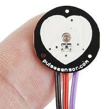

# Scanner Project

## Integrantes
- Osmar Israel Villegas Martinez 
- Jose Armando Gutierrez Rodriguez
- Victor Andres Garay Montes

## Visión
El objetivo del proyecto es desarrollar un producto de calidad capaz de monitorear los signos vitales del usuario para entregarselos de una forma práctica, el proyecto esta pensado especialmente para aquellas personas que cuentan con la necesidad de saber estas informacón, para cumplir con el proposito el dispositivo implementa técnologias para la recolección y analisis de datos para poder dar toda la información resumida al usario final.

## Objetivo general
Diseñar y desarrollar un sistema de IoT (Internet de las cosas) que permita monitorear los signos vitales del usuario, monitoreando y entregando la información al usuario final de forma resumida.

### Objetivos específicos
Implementar un sistema de análisis del usuario que monitorice condiciones como presión sanguinea, temperatura y ritmo cardiaco, en base a los resultados el sistema realiza un resumen de la información para el usuario final.

## Arquitectura

## Librerias Utilizadas
- Pin

- Sleep

- SoftwareSerial

- DFRobotDFPlayerMini

- Wire

- LiquidCrystal_I2C

- WiFi

- PubSubClient

- I2C (Inter-Integrated Circuit)

- ssd1306.py

## Tabla de Software utilizado
| Id | Software | Version | Tipo |
|----|----------|---------|------|
| 1 |  Postgresql  | 15.1.0 | SQL |
| 2 | Thonny  | 4.1.4 |  IDE |
| 3 | Node-Red | 3.2.9 | MQTT |
| 4 | Firebase | 13.8.0 | NoSQL |
| 5 | Flutterf | 3.22.2 | IDE |

## Tabla con el hardware utilizado (El costo de cada componente es al dia de 2 de junio del 2024)
| Id | Componente | Descripción | Imagen | Cantidad | Costo total |
|----|------------|-------------|--------|----------|-------------|
|1|Sensor de frecuencia cardiaca|Sensor de ritmo cardiaco. ||1|$47,03 MXN|
|2|Sensor de temperatura|Sensor para medir la temperatura del ambiente. ||1|$17,04 MXN|
|3|DFPlayer-Mini Módulo/bocina y tarjeta sd|Modulo DFPlayer permite la reproducción de audios grabados en una memoria sd.||1|$26,46 MXN|
|4|ESP32|ESP32 es la denominación de una familia de chips SoC de bajo coste y consumo de energía, con tecnología Wi-Fi y Bluetooth de modo dual integrada.||2|$250.00 MXN|
|5|Ultrasonido|Modulo de ultrasonido especializado para humidificar.||1|$11,42|
|6|Pantalla (Weareble)|Reloj inteligente ESP32, dispositivo programable con WIFI, Bluetooth, papel electrónico, Hardware y Software de código abierto||1|$356,64|
|7|Ventilador| Ventilador de bajo consumo. ||1|$16,87|
|8|Placa de pruebas sin soldadura| Placa de pruebas sin soldadura MB-102 400/830 puntos de conexión, placa de desarrollo de prueba PCB blanca/transparente, bricolaje para prototipos de escudo Arduino||1|$68,86|
|9|Cautin| Soldador inteligente Original FM01 T65, equipo de soldadura PD, máquina de estación eléctrica, herramientas de reparación de Cautín, puntas FM65||1|$68,86|
|10|Cables | Cable de puente de cobre, Conector de línea Flexible sin soldadura de pruebas para placa Arduino DIY, 10cm, 20cm, 30cm, macho, hembra, 24AWG | |30|$56,61|
|11|Banco de energía | Xiaomi-Banco de energía de alta capacidad, cargador de batería portátil de 120W, 30000mAh, para iPhone, Samsung y Huawei | |1|$278,81|

## Epicas del proyecto (Minimo debe de haber una épica por integrante de equipo)
- Monitorear las condiciones del usuario: esta épica se enfoca en el monitoreo de las caracteristicas del individuo, como temperatura, ritmo cardiaco y signos vitales. El objetivo es tener una medición confiable de esta información para almacenarla y presentarla al usuario de una forma resumida y util en una aplicación.

- Control del ambiente: esta épica se enfoca en el control del ambiente por medio del dispositivo, para ello utiliza un sensor un ventilador, un humidificador y un modulo DFPlayer. El objetivo es mejorar la calidad del ambiente en un rango óptimo para el usuario.

- Almacenamiento y analsis de datos: esta épica se enfoca en el almacenamiento y analiss de la información recopilada en tiempo real por medio de los sensores. El objetivo es enviar los datos medidos por los sensores a una base de datos y permitir su consumo para el análisis de los datos y su posteropr entrega a forma de resumen al usuario.

## Tabla de historias de usuario
| Id | Historia de usuario | Prioridad | Estimación | Como probarlo | Responsable |
|----|---------------------|-----------|------------|---------------|-------------|
|  1  | Como usuario quiero que se monitorice en tiempo real la temperatura que tengo para tener información más fiel a la realidad.| 1 | 3 Dias | Se obtiene información fiel en tiempo real através del sensor.| Osmar Israel Villegas Martínez |
|  2  | Como usuario quiero que se monitorice en tiempo real mi ritmo cardiaco para tener información más fiel a la realidad.| 1 | 3 Dias | Se obtiene información fiel en tiempo real através del sensor.| Osmar Israel Villegas Martínez |
|  3  | Como usuario quiero que se monitorice en tiempo real mi ritmo cardiaco que tengo para tener información más fiel a la realidad.| 1 | 3 Dias | Se obtiene información fiel en tiempo real através del sensor.| Osmar Israel Villegas Martínez |
|  4  | Como usuario quiero una interfaz grafica para poder interactuar con la información obtenida facilmente. | 2 | 1 Semana | Se puede visualizar las graficas sin problemas desde un dispositivo movil, no existen errores graficos. | Victor Andrés Garay Montes|
|  5  | Como usuario quiero tener un resumen de calidad de la información recopilada por los sensores.| 2 | 2 Semanas | Se da un resumen fiel a la información obtenida, no tiene errores graficos y es accesible desde un télefono movil. | Victor Andrés Garay Montes |
|  6  | Como desarrollador quiero que la información se almacene en una base de datos que permita un facil y rapido acceso para facilitar su manejo. | 2 | 5 Dias | Se puede almacenar y acceder a la información para realizar el resumen y generar las graficas sin problemas desde cualquier dispositivo. | Jose Armanado Gutierrez Rodriguez |
|  7  | Como usuario quiero que el dispositivo sea comodo de usar para que no me moleste al portarlo.| 3 | 1 Semana |El dispositivo que usa el usuario es comodo.| Osmar Israel Villegas Martínez |
|  8 | Como usuario quiero poder encender un ventilador para mejorar las condiciones del ambiente.| 3 | 1 Semana |Se coloca puede encender de forma remota un ventilador.| Jose Armando Gutierrez Rodriguez |
|  9 | Como usuario quiero poder configurar el dispositivo para humidificar el ambiente. | 4 | 1 Semana |Como usuario quiero poder configurar el dispositivo para humidificar el ambiente.| Jose Armando Gutierrez Rodriguez |

## Tablero Kanban

## Prototipo en dibujo
Coloca la fotografia de tu prototipo dibujado a lapiz -- Aun no se cuenta con prototipo.

## Codigo

## Fritzing

## Pantallas Square Line Studio

## Video demostracion

## Evidencias fotograficas

