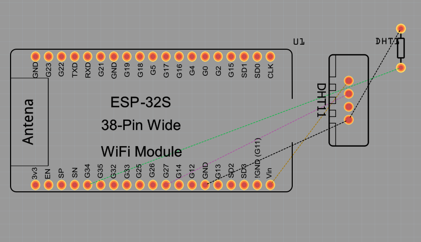

# Hypno's Dream Project

## Integrantes
- Osmar Israel Villegas Martinez 
- Jose Armando Gutierrez Rodriguez
- Victor Andres Garay Montes

## Visión
El objetivo del proyecto es desarrollar un producto de claidad capaz de monitorear y mejorar la calidad de sueño del usuarios final, el proyecto esta pensado especialmente para aquellas personas que cuentan con problemas del sueño, para cumplir con el proposito el dispositivo implementa técnologias para la recolección y analisis de datos para poder dar recomendaciones al usario final.

## Objetivo general
Diseñar y desarrollar un sistema de IoT (Internet de las cosas) que permita monitorear y controlar el ambiente de una habitación con el fin de mejorar la calidad de sueño del usuario, monitoreando y en el caso de ser necesario mejorando las condiciones del ambiente para garantizar un sueño de calidad.

### Objetivos específicos
Implementar un sistema de análisis del ambiente que monitorice condiciones como luz, ruido, temperatura y ritmo cardiaco en una habitación, en base a los resultados el sistema puede mejorar la calidad del ambiente y activar automáticamente mecanismos como un ventilador o música cuando las condiciones puedan llegar a perjudicar la calidad del sueño.

## Arquitectura

## Librerias Utilizadas
- Pin

- Sleep

- SoftwareSerial

- DFRobotDFPlayerMini

- Wire

- LiquidCrystal_I2C

- WiFi

- PubSubClient

- I2C (Inter-Integrated Circuit)

- ssd1306.py

## Tabla de Software utilizado
| Id | Software | Version | Tipo |
|----|----------|---------|------|
| 1 |  Postgresql  | 15.1.0 | SQL |
| 2 | Thonny  | 4.1.4 |  IDE |
| 3 | Node-Red | 3.2.9 | MQTT |
| 4 | Firebase | 13.8.0 | NoSQL |
| 5 | Square Line Studio | 1.4.1 | IDE |

## Tabla con el hardware utilizado (El costo de cada componente es al dia de 2 de junio del 2024)
| Id | Componente | Descripción | Imagen | Cantidad | Costo total |
|----|------------|-------------|--------|----------|-------------|
|1|Sensor de frecuencia cardiaca|Sensor de ritmo cardiaco para medir la calidad de sueño. ||1|$47,03 MXN|
|2|Sensor de temperatura|Sensor para medir la temperatura del ambiente. ||1|$17,04 MXN|
|3|Fotorresistencia|Sensor capaz de medir la oscuridad del ambiente.||2|$13,97 MXN|
|4|Sensor de ruido|Sensor para medir el ruido del ambiente.||1|$23,69 MXN|
|5|DFPlayer-Mini Módulo/bocina y tarjeta sd|Modulo DFPlayer permite la reproducción de audios grabados en una memoria sd.||1|$26,46 MXN|
|6|ESP32|ESP32 es la denominación de una familia de chips SoC de bajo coste y consumo de energía, con tecnología Wi-Fi y Bluetooth de modo dual integrada.||2|$250.00 MXN|
|7|Ultrasonido|Modulo de ultrasonido especializado para humidificar.||1|$11,42|
|8|PantallaTFT|Pantalla TFT con esp32 programable.||1|$653.78|
|9|Pantalla (Weareble)|Reloj inteligente ESP32, dispositivo programable con WIFI, Bluetooth, papel electrónico, Hardware y Software de código abierto||1|$356,64|
|10|Ventilador| Ventilador de bajo consumo. ||1|$16,87|
|11|Placa de pruebas sin soldadura| Placa de pruebas sin soldadura MB-102 400/830 puntos de conexión, placa de desarrollo de prueba PCB blanca/transparente, bricolaje para prototipos de escudo Arduino||1|$68,86|
|12|Cautin| Soldador inteligente Original FM01 T65, equipo de soldadura PD, máquina de estación eléctrica, herramientas de reparación de Cautín, puntas FM65||1|$68,86|
|13|Cables | Cable de puente de cobre, Conector de línea Flexible sin soldadura de pruebas para placa Arduino DIY, 10cm, 20cm, 30cm, macho, hembra, 24AWG | |30|$56,61|
|14|Banco de energía | Xiaomi-Banco de energía de alta capacidad, cargador de batería portátil de 120W, 30000mAh, para iPhone, Samsung y Huawei | |1|$278,81|

## Epicas del proyecto (Minimo debe de haber una épica por integrante de equipo)
- Monitorear las condiciones ambientales de una habitación: esta épica se enfoca en el monitoreo de las condicioens ambientales de la habitación, como temperatura, ruido y oscuridad del ambiente. El objetivo es medir estos factores y evaluarlos para realizar acciones que puedan que puedan mejorar la calidad del sueño, tambien la información se recopilara y se visualizara a forma de resumen.

- Control de calidad del ambiente: esta épica se enfoca en el control automático de la calidad del ambiente, para ello utiliza un sensor de temperatura, un ventilador, un sensor de ruido y un modulo DFPlayer. El objetivo es mejorar la calidad del ambiente en un rango óptimo para un sueño de calidad, los componentes se activa automáticamente cuando los niveles se encuentan por debajo del umbral desaedo.

- Almacenamiento y analsis de datos: esta épica se enfoca en el almacenamiento y analiss de la información recopilada en tiempo real por medio de los sensores. El objetivo es enviar los datos medidos por los sensores a una base de datos y permitir su consumo para el análisis de los datos para entregarlos a forma de resumen al usuario.

## Tabla de historias de usuario
| Id | Historia de usuario | Prioridad | Estimación | Como probarlo | Responsable |
|----|---------------------|-----------|------------|---------------|-------------|
|  1  | Como usuario quiero que se monitorice en tiempo real la temperatura que tengo para tener información más fiel a la realidad.| 1 | 3 Dias | Se obtiene información fiel en tiempo real através del sensor.| Osmar Israel Villegas Martínez |            |
|  2  | Como usuario quiero que se monitorice en tiempo real mi ritmo cardiaco que tengo para tener información más fiel a la realidad.| 1 | 3 Dias | Se obtiene información fiel en tiempo real através del sensor.| Osmar Israel Villegas Martínez |
|  3  | Como usuario quiero que se monitorice en tiempo real la luz de mi cuarto para obtener información más fiel a la realidad.| 1 | 3 Dias | Se obtiene información fiel en tiempo real através del sensor.| Osmar Israel Villegas Martínez |
|  4  | Como usuario quiero que se monitorice en tiempo real el ruido en mi cuarto para obtener información más fiel a la realidad.| 1 | 3 Dias | Se obtiene información fiel en tiempo real através del sensor.| Osmar Israel Villegas Martínez |
|  5  | Como usuario quiero una interfaz grafica para poder interactuar con la información obtenida facilmente. | 2 | 1 Semana | Se puede visualizar las graficas sin problemas desde un dispositivo movil, no existen errores graficos. | Victor Andrés Garay Montes|
|  6  | Como usuario quiero tener un resumen de la calidad de mi sueño para obtener la información importante más facilmente.| 2 | 2 Semanas | Se da un resumen fiel a la información obtenida, no tiene errores graficos y es accesible desde un télefono movil. | Victor Andrés Garay Montes |
|  7  | Como desarrollador quiero que la información se almacene en una base de datos que permita un facil y rapido acceso para facilitar su manejo. | 2 | 5 Dias | Se puede almacenar y acceder a la información para realizar el resumen y generar las graficas sin problemas desde cualquier dispositivo. | Jose Armanado Gutierrez Rodriguez |
|  8  | Como usuario quiero saber la duración de mi sueño para saber si dormi las horas necesarias.| 2 | 1 Semana |Se da un resumen fiel a la información obtenida, no tiene errores graficos y es accesible desde un télefono movil.| Victor Andrés Garay Montes |
|  9  | Como usuario quiero que el dispositivo sea comodo de usar para que no me moleste al dormir.| 3 | 1 Semana |El dispositivo que usa el usuario es comodo.| Osmar Israel Villegas Martínez |
|  10 | Como usuario quiero poder colocar ruido para dormir facilmente desde la aplicación para ayudarme a dormir.| 3 | 1 Semana |Se coloca ruido entre una lista de sonidos, el dispositivo responde rapidamente y no permite generar un ruido que moleste a los usuarios al momento de dormir.| Jose Armando Gutierrez Rodriguez |
|  11 | Como usuario quiero poder configurar el dispositivo para humidificar el ambiente. | 4 | 1 Semana |Como usuario quiero poder configurar el dispositivo para humidificar el ambiente.| Jose Armando Gutierrez Rodriguez |
|  12 | Como usuario quiero poder configurar un recordatorio para dormir. | 5 | 1 Semana |Se puede configurar desde la aplicación y permite al usuario control sobre su ejecución.| Jose Armando Gutierrez Rodriguez |

## Tablero Kanban

## Prototipo en dibujo
Coloca la fotografia de tu prototipo dibujado a lapiz -- Aun no se cuenta con prototipo.

## Codigo

## Fritzing

## Pantallas Square Line Studio

## Video demostracion

## Evidencias fotograficas

